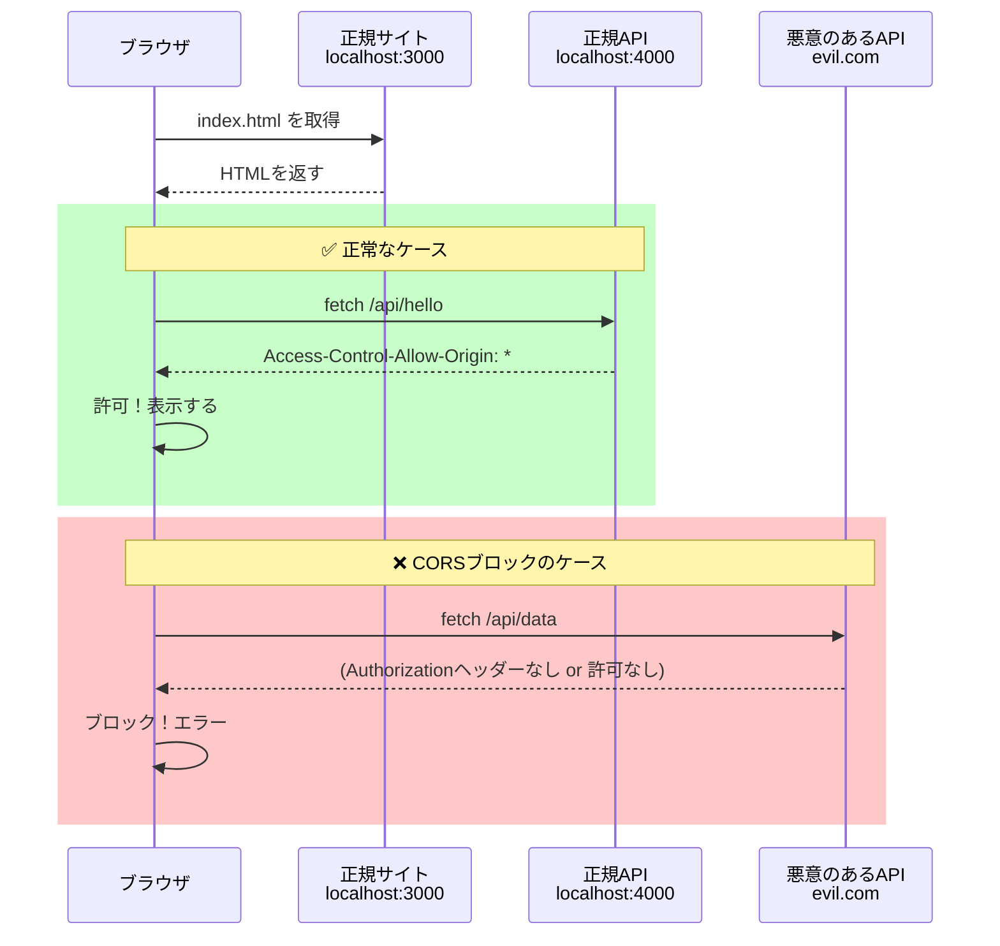

## CORSとは

CORSは Cross-Origin Resource Sharing の略称です。
ブラウザには「同じサーバー以外からデータを勝手に取ってきてはいけない」というセキュリティルールがあり、これはブラウザ側の制限です。

### 例

- 自分のサイト: http://localhost:3000
- 別のサーバーのAPI: http://localhost:4000

このときブラウザがブロックします。
これを解除するために、API側が「このサーバーからのアクセスは許可するよ」と宣言するのがCORSです。

### 通信の流れ（図）

